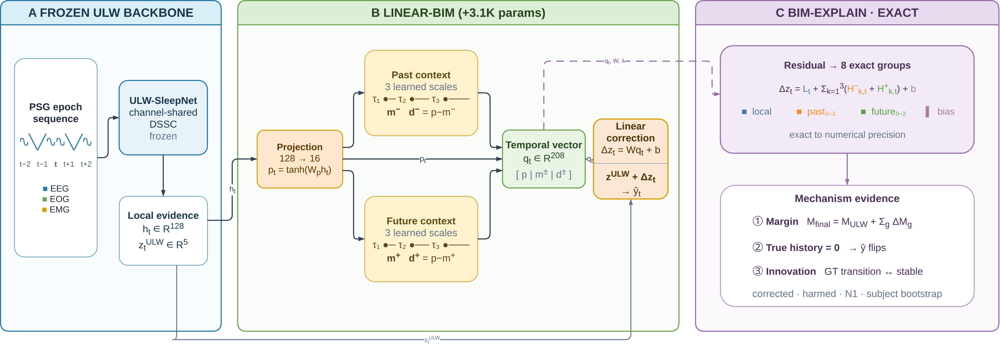

# Linear-BIM and BIM-Explain

Lightweight bidirectional temporal correction for a frozen ULW-SleepNet
backbone, with exact additive explanations of the correction.

This repository contains the current Python implementation, focused tests,
primary prediction results, and selected paper tables and figures. It does not
contain model weights, EEG recordings, embedding caches, or historical
experimental packages.

## Code

| Component | Location |
|---|---|
| ULW backbone definitions | `src/linear_bim/models/backbone.py` |
| Linear-BIM and current-only head | `src/linear_bim/models/bim.py` |
| Recording-wise sequence padding | `src/linear_bim/data/` |
| Frozen-backbone head training | `src/linear_bim/training/head.py` |
| Prediction evaluation | `src/linear_bim/evaluation/` |
| Coordinate and exact-history explanations | `src/linear_bim/explain/` |
| Command-line entry point | `src/linear_bim/cli.py` |
| Dataset configurations | `configs/paper/` |

## Installation and evaluation

Run from the repository root:

```bash
python3 -m venv .venv
.venv/bin/python -m pip install -e '.[test]'
.venv/bin/python -m linear_bim evaluate --config configs/paper/s20.yaml
.venv/bin/python -m linear_bim evaluate --config configs/paper/s78.yaml
.venv/bin/python -m linear_bim evaluate --config configs/paper/s3.yaml
.venv/bin/python -m pytest -q tests
```

The bundled prediction-only NPZ files support metric recomputation without
weights or raw EEG. Configuration paths for training inputs are intentionally
not populated by this release; `doctor` reports missing training prerequisites.
Optional dependencies for data processing and plotting are available as
`.[data,plot]`. CUDA/Triton compatibility must be checked in the target environment.

## Primary results

| Dataset | Epochs | Linear-BIM ACC (%) | Macro-F1 (%) |
|---|---:|---:|---:|
| Sleep-EDF-20 | 32,843 | 88.00 | 82.59 |
| Sleep-EDF-78 | 195,099 | 84.04 | 78.31 |
| ISRUC-S3 | 8,589 | 83.12 | 81.77 |

These are **author-compatible, held-out-selected results, not independent
clean-test estimates**. Sleep-EDF-78 also has subject overlap in its historical
split. ISRUC-S3 uses the GitHub-matched 8,589-epoch setting. The datasets must not
be interpreted as a controlled, matched-protocol comparison against external
papers.

- [Detailed primary metrics](results/primary_metrics.csv)
- [Paper tables](paper/tables/PAPER_TABLES.md)
- Per-dataset and per-fold metrics: `results/{s20,s78,s3}.json`
- Prediction arrays: `artifacts/frozen/{s20,s78,s3}/frozen_outputs.npz`

`U0` in the machine-readable results is the locally trained frozen baseline.
The official/published ULW reference in Paper Table I is a separate reference;
its values must not be substituted for the local U0 predictions.

## Training and explanation scope

The supported training command trains only the BIM head from supplied
embeddings and U0 logits:

```bash
.venv/bin/python -m linear_bim train \
  --config configs/paper/s20.yaml \
  --stage head --fold 0 --device cuda:0 --run-id s20-head-example \
  --train-npz /path/to/train.npz --held-npz /path/to/held.npz
```

Both inputs require `sequence_ids`, `epoch_indices`, `embeddings`, `u0_logits`,
and `labels`. Sequence IDs identify recordings, not pooled subjects with multiple
nights. The head uses Adam, constant learning rate 0.001, unweighted cross-entropy,
gradient clipping at norm 5, and 200 full-recording-batch updates by default.
The earliest maximum held-out accuracy determines the selected checkpoint.

Full end-to-end preprocessing/backbone experiment runners and optimizer/RNG
resume are not implemented in this standalone interface. No full GPU replay is
claimed for this release. The package exposes both 14-coordinate and 8-group
local/history explanation primitives; the CLI `explain` adapter currently
supports coordinate explanations from supplied features and residual weights.

## Figures

### Architecture



### Exact attribution example


The attribution figure is an illustrative example, not an aggregate performance
claim. PDF, SVG, and editable draw.io versions accompany the PNG assets.

## Repository history

The initial 20 commits are an **explicitly reconstructed import history**, not
the original development log. Their author dates are distributed from
mid-August to September 2026 for organization; they are not evidence that those
Git commits or final code snapshots existed on those dates. Committer dates
record the actual import. Every reconstructed commit carries an explanatory
trailer. Author attribution was authorized by the two collaborators and is
allocated as 12 commits to Nhan Tran and 8 to Kiet Tran; this allocation is not a
measurement of their relative development effort.
