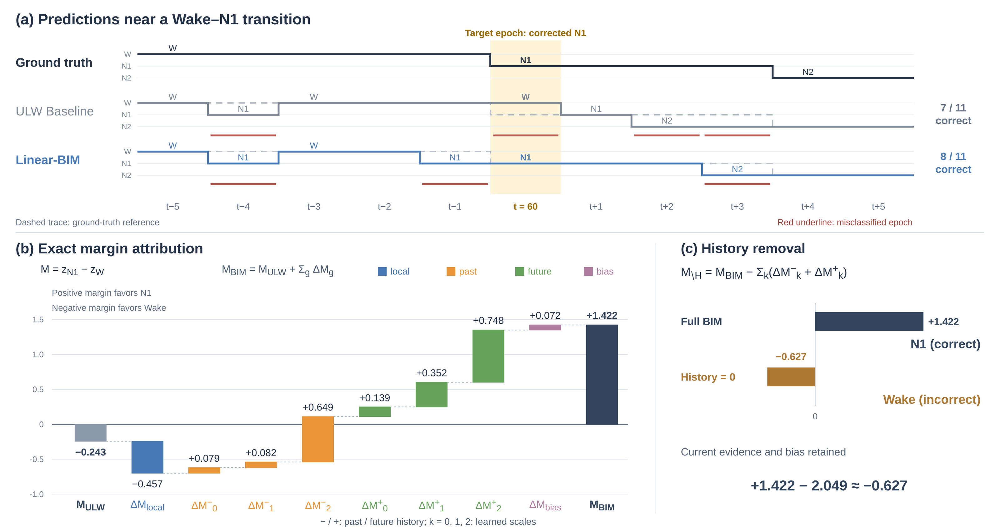

# Linear-BIM + BIM-Explain — Paper Tables & Figs

## Table I. Main results against official ULW-SleepNet

| Dataset (epochs) | Model                |              ACC (%) ↑ |         Macro-F1 (%) ↑ |                    κ ↑ |            N1 F1 (%) ↑ |        Params ↓ |        FLOPs ↓ |
| ---------------- | -------------------- | ----------------------: | ----------------------: | -----------------------: | ----------------------: | ---------------: | --------------: |
| Sleep-EDF-20     | ULW-SleepNet         |                   86.87 |                   80.68 |                    0.820 |                   45.77 | **13.34K** | **7.89M** |
|                  | **Linear-BIM** | **88.00 (+1.13)** | **82.59 (+1.91)** | **0.836 (+0.016)** | **52.91 (+7.14)** |  16.45K (+3.11K) |         ≈7.90M |
| Sleep-EDF-78     | ULW-SleepNet         |                   81.39 |                   74.01 |                    0.740 |                   39.29 | **13.34K** | **7.89M** |
|                  | **Linear-BIM** | **84.04 (+2.65)** | **78.31 (+4.30)** | **0.777 (+0.037)** | **48.58 (+9.29)** |  16.45K (+3.11K) |         ≈7.90M |

## Table II. Component-wise counterfactual ablation on Sleep-EDF-20

| Ablated component | Configuration | ACC (%) ↑ | MF1 (%) ↑ | N1 F1 (%) ↑ | ΔACC (pp) |
|---|---|---:|---:|---:|---:|
| **Full Linear-BIM** | $D=16,\ K=3$; bidirectional | **88.00** | **82.59** | **52.91** | — |
| **Temporal history** | $H^{-}=H^{+}=0$ | 85.91 | 80.36 | 47.86 | −2.09 |
| | $H^{-}=0$ | 86.19 | 80.59 | 47.50 | −1.81 |
| | $H^{+}=0$ | 87.35 | 81.86 | 51.64 | −0.65 |
| **Feature family** | Memory: $m^{\pm}=0$ | 87.78 | 82.15 | 51.33 | −0.22 |
| | Innovation: $d^{\pm}=0$ | 87.37 | 81.56 | 49.97 | −0.63 |
| **Scale removal** | $m_0^{\pm}=d_0^{\pm}=0$ | 87.73 | 82.33 | 52.19 | −0.27 |
| | $m_1^{\pm}=d_1^{\pm}=0$ | 87.79 | 82.24 | 51.68 | −0.21 |
| | $m_2^{\pm}=d_2^{\pm}=0$ | 87.76 | 81.96 | 50.92 | −0.24 |

*All interventions are applied at inference without retraining. $D$: projection dimension; $K$: number of scales; $H^{-}/H^{+}$: exact past/future history contributions; $m/d$: memory/innovation coordinates; $\pm$: both temporal directions. ΔACC is relative to Full Linear-BIM.*

## Table III. Learned multi-scale memory constants

**Optional; recommended for supplementary material if space is limited.**

| Dataset        |  λ₀ |        τ₀ (min) |  λ₁ |        τ₁ (min) |  λ₂ |        τ₂ (min) |
| -------------- | ----: | ----------------: | ----: | ----------------: | ----: | ----------------: |
| Initialization | 0.607 |              1.00 | 0.779 |              2.00 | 0.882 |              4.00 |
| Sleep-EDF-20   | 0.607 | 1.00 [0.95–1.01] | 0.766 | 1.88 [1.76–2.01] | 0.873 | 3.68 [3.53–4.00] |
| Sleep-EDF-78   | 0.623 | 1.06 [1.05–1.08] | 0.759 | 1.81 [1.76–1.89] | 0.866 | 3.48 [3.43–3.53] |
| ISRUC-S3       | 0.607 | 1.00 [1.00–1.00] | 0.779 | 2.00 [2.00–2.01] | 0.883 | 4.01 [4.00–4.04] |

For each shared past/future pole,

$$
\tau_k^{\mathrm{epochs}}=-\frac{1}{\ln \lambda_k},
\qquad
\tau_k^{\mathrm{minutes}}=0.5\tau_k^{\mathrm{epochs}}.
$$

## Figure 2. Exact explanation of a corrected N1 epoch

**Figure 2.** (A) Ground-truth and model predictions around the explained epoch
(shaded). Dashed traces repeat the ground-truth reference; red underlines mark
misclassified epochs. Within this illustrative 11-epoch window, ULW Baseline
and Linear-BIM correctly classify 7 and 8 epochs, respectively.
(B) Eight additive contributions to the N1-minus-Wake logit margin.
(C) Removing all six true-history contributions reverses the correction while
retaining local evidence and bias. Temporal memories extend beyond the
displayed window. This illustrative case uses the self-trained ULW parent
under held-out selection; it is not an attribution of the official weights
used as the reference in Table I. The displayed label “ULW Baseline” denotes
this self-trained parent.

[Vector PDF](../figures/fig2-exact-attribution/conference-v4/fig2-exact-attribution.pdf) · [Vector SVG](../figures/fig2-exact-attribution/conference-v4/fig2-exact-attribution.svg) · [Editable draw.io](../figures/fig2-exact-attribution/conference-v4/fig2-exact-attribution.drawio)
